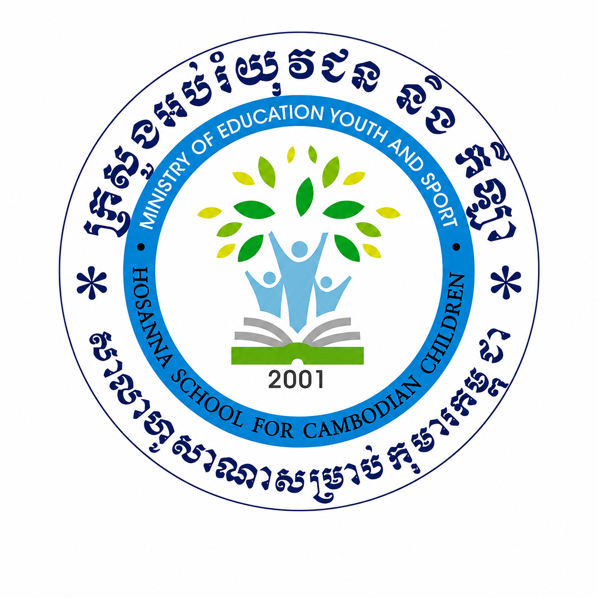

<p align="center">
  
</p>

<h1 align="center">Hosanna School for Cambodian Children</h1>

<p align="center">
  <em>From a Phnom Penh slum to generational hope — quality education for 800+ children, from Early Childhood to Grade 12.</em>
</p>

<p align="center">
  
  
  
</p>

<p align="center">
  <strong>🚀 Live site:</strong> <a href="https://hosanna-school-iota.vercel.app">hosanna-school-iota.vercel.app</a>
</p>

---

## ✨ Highlights

- **🎓 800+ students** educated from Early Childhood through Grade 12, recognized by the Cambodian Ministry of Education, Youth and Sport (MoEYS).
- **🔄 The Cycle of Blessing** — early graduates earned university degrees and returned as full-time certified teachers.
- **💙 Real micro-impact** — $15/mo flattens the micro-costs of poverty (printouts, clean water, uniforms, transport).
- **🎵 Student Choir** — local pride, featured alongside Cambodian artists including KESORRR.
- **🏫 Location** — Pou Senchey District, Phnom Penh, backed by Sydney Hosanna Incorporated (Australia).

## 🚀 Quick Start

```bash
npm install
npm run dev      # local dev at http://localhost:5173
```

Production build & preview:

```bash
npm run build    # type-check + bundle to dist/
npm run preview  # serve the production build
```

## 🧱 Stack

| Layer | Tech |
|---|---|
| UI | React 19 + TypeScript 6 |
| Build | Vite 8 |
| Styling | Tailwind CSS v4 |
| Motion | GSAP + Lenis (smooth scroll) |
| Icons | Lucide |

## 🤖 Agent Instructions

This repo ships a full AI context layer for any tool (Claude Code, Codex, AGI, Antigravity CLI):

- **Router** — [`AGENTS.md`](AGENTS.md) / [`CLAUDE.md`](CLAUDE.md)
- **Agent Brain** — [`context/AGENT.md`](context/AGENT.md) (current state & handoff)
- **Deep Reference** — [`context/LAWS.md`](context/LAWS.md) (school records & brand laws)
- **Identity Layer** — [`context/USER.md`](context/USER.md), [`SOUL.md`](context/SOUL.md), [`IDENTITY.md`](context/IDENTITY.md), [`SKILL_INDEX.md`](context/SKILL_INDEX.md)
- **Recreate Spec** — [`docs/recreate-prompt.md`](docs/recreate-prompt.md)

## 📄 License

All rights reserved. © 2026 Hosanna School for Cambodian Children (Hope School / 희망학교). No part of this project may be reproduced without written permission.
